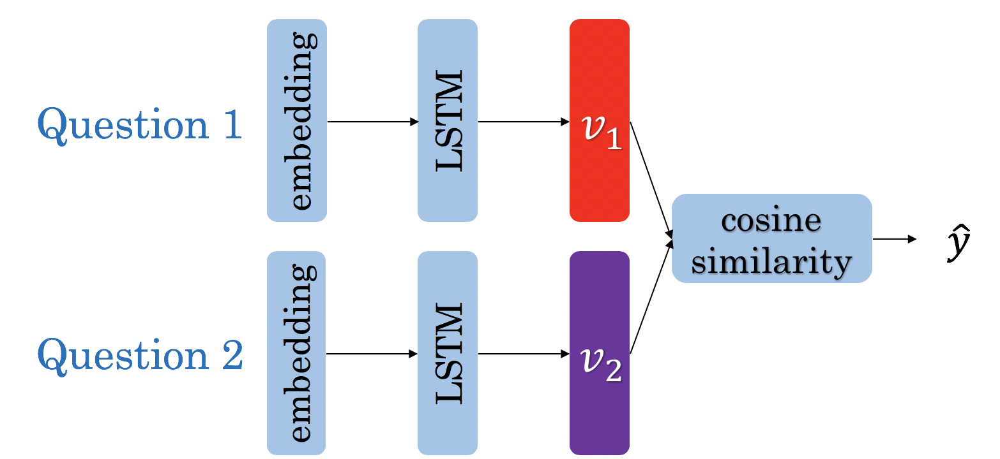

# Deep LSTSM Network for question duplicate

Build a Siamese network that identifies question duplicates in a dataset from Quora.

Details:
- [Trax framework](https://github.com/google/trax) used by Google Brain Team
- [Dataset from Quora](https://www.kaggle.com/c/quora-question-pairs/overview)
- Embedding using a built vocabulary on the training dataset

## About Siamese Network
-  SNNs won’t output the probabilities of the prediction, only distance from each class.
-  Since training SNNs involve pairwise learning, we cannot use cross entropy loss cannot be used. There are two loss functions we typically use to train siamese networks: triplet loss and contrastive loss

## Triplet loss

Triplet loss is composed of two terms. One term utilizes the mean of all the non duplicates, the second utilizes the *closest negative*. Our loss expression is then:

 $$ Loss_{1}(A,P,N) &=\max \left( -cos(A,P)  + mean_{neg} +\alpha, 0\right)$$ \\
 $$ Loss_{2}(A,P,N) &=\max \left( -cos(A,P)  + closest_{neg} +\alpha, 0\right)$$ \\
 $$ Loss(A,P,N) &= mean(Loss_1 + Loss_2) $$\

## Evaluation

The siamese network is evaluated using accuracy, depending on a threshold t. The threshold selected is 0.7' A higher threshold means that only very similar questions will be considered as the same question

Accuracy increases with the threshold unitl a threshold above 0.7, the accuracy decreases

## Resources
- [Natural Language Processing - DeepLearning.ai](https://www.coursera.org/learn/sequence-models-in-nlp/home/welcome)
